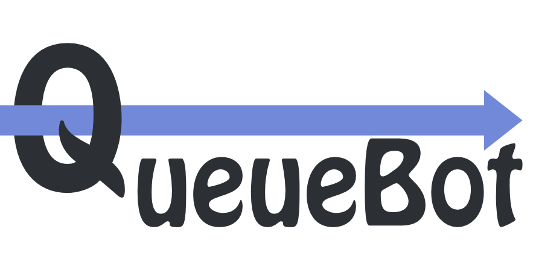
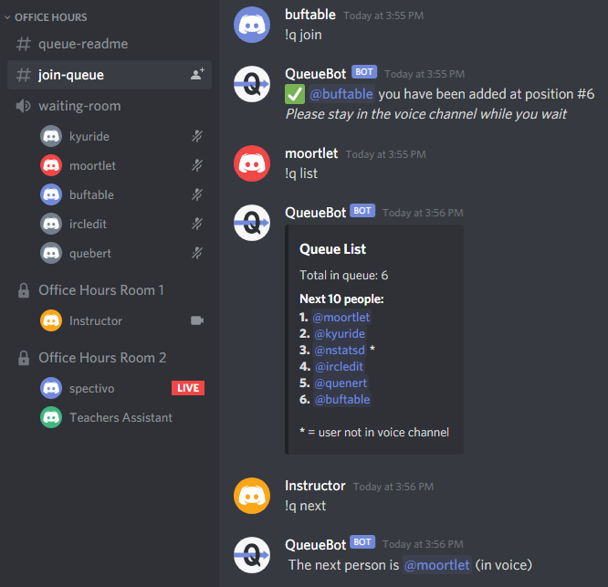
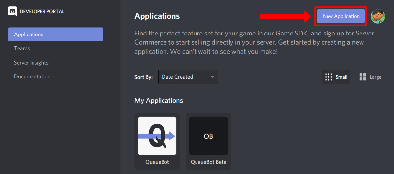
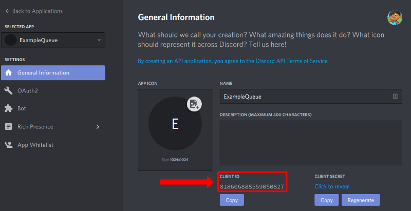
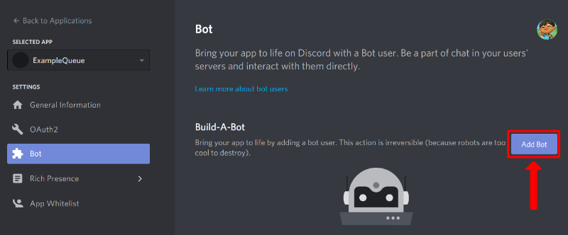
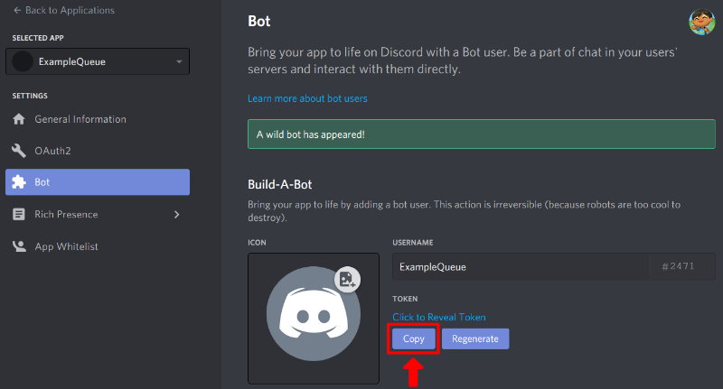

# QueueBot



QueueBot is an IRC-like bot for Discord. It is used to facilitate online Office Hours (hence the use of terms like "Instructor" and "TAs") by keeping track of students in a queue.

## Table of Contents

- [QueueBot](#queuebot)
  - [Table of Contents](#table-of-contents)
  - [QueueBot in Action](#queuebot-in-action)
  - [Connecting Bot to Discord](#connecting-bot-to-discord)
  - [Configuration](#configuration)
    - [Running with Command Line](#running-with-command-line)
      - [Project Setup](#project-setup)
      - [Starting the Bot](#starting-the-bot)
    - [Running with Docker](#running-with-docker)
    - [Modifying the Config](#modifying-the-config)
      - [Config Options](#config-options)
      - [Example Config](#example-config)
        - [JSON](#json)
        - [Docker](#docker)
    - [Bot Commands](#bot-commands)
    - [Running Unit Tests](#running-unit-tests)
      - [Running All Unit Tests](#running-all-unit-tests)
      - [Running a Specific Unit Test File](#running-a-specific-unit-test-file)
      - [Running Specific Unit Test Method](#running-specific-unit-test-method)
    - [Checking Coverage](#checking-coverage)

## QueueBot in Action



## Connecting Bot to Discord

Before configuring the bot, it needs to be added to the appropriate discord server.

1. Go to [Discord's developer portal](https://discord.com/developers/applications) and create a new application (top-right button).  

2. Under the `General Information tab`, take a note of the Client ID as it will be used in step 5  

3. On the left panel, click `Add a Bot` to convert the application to a bot account  

4. Name it, give it profile picture, etc.
     - Enable the "Server Members Intent" option under the "Privileged Gateway Intents"
         if you intend on enabling the config values [`CHECK_VOICE_WAITING`](#modifying-the-config) or [`ALERT_ON_FIRST_JOIN`](#modifying-the-config)
5. Obtain your bot's Token by clicking the `Copy` button and save it for future reference (referred to as `SECRET_TOKEN` within the [configuration](#modifying-the-config) section).  
**NOTE: the token is essentially your bot's password. Keep it secure and do not share it.**  

5. Open the following link and after changing the `client_id` parameter in the url with the Client ID you saved from step 2
```bash
# Swap out REPLACE_WITH_YOUR_CLIENT_ID with the correct Client ID from step 2
https://discordapp.com/oauth2/authorize?&client_id=REPLACE_WITH_YOUR_CLIENT_ID&scope=bot&permissions=84032
```
6. Choose the server you want the bot to join and accept.

> NOTE: While it is possible to add the same bot account to multiple servers, it will only listen to the first server it joins

## Configuration

The bot can be run like a normal command line application or within a Docker container. Each method uses a different way to configure the bot.

### Running with Command Line

#### Project Setup

0. Ensure you have Python 3.7+ installed
1. Clone this repository
2. `cd` into the repo folder
3. Create a Python virtual environment
   - `py -3 -m venv venv`
   - You may need to install `python3-venv` on Linux
4. Activate the virtual environment
   - Windows: `venv\Scripts\activate.bat`
   - Linux: `source venv/bin/activate`
5. Upgrade pip
   - `python -m pip install --upgrade pip`
6. Install queuebot required packages
   - `pip install -r requirements-prod.txt`
7. Generate `config.json` by running the bot for the first time
   - `python queuebot.py`
8. Move on to [Modifying the Config](#modifying-the-config)

#### Starting the Bot

Once the project is set up, you simply need to activate the python virtual environment ([see step 4 above](#project-setup)) then run the program with `python queuebot.py`

### Running with Docker

TODO Steps to pull image from github containers

1. Ensure you have Docker installed and set up
2. Clone this repository
3. `cd` into the repo folder
4. Build the docker image
   - `docker build -t queuebot:latest .`
5. Move on to [Modifying the Config](#modifying-the-config)

### Modifying the Config

> **Docker Users:** When passing config values as environmental variables, each variable must start with the prefix `QUEUE_`. As a result, if you want to pass in your `SECRET_TOKEN` you would use the environment variable `QUEUE_SECRET_TOKEN`  
>  
> Lists, unlike the json config, is specified by having a comma-separated string

#### Config Options

| Name                  | Type | Description  |
|-----------------------|------|--------------|
| SECRET_TOKEN          | String | Discord Token which the bot uses for authentication (see [Connecting bot to Discord](#connecting-bot-to-discord) on how to get it). |
| TA_ROLES              | List of Strings | A list of discord roles which signify TAs/Instructors. Users with any of these roles can run TA commands. |
| LISTEN_CHANNELS       | List of Strings | A list of text channels which the bot will listen in for queries. |
| CHECK_VOICE_WAITING   | Boolean | When enabled, the bot will only allow people to join the queue when they have joined a voice channel (specified with `VOICE_WAITING` option). |
| VOICE_WAITING         | String | Specifies which voice channel students will join while they wait for a TA to become available. Does not need to be populated if `CHECK_VOICE_WAITING` is False. |
| ALERT_ON_FIRST_JOIN   | Boolean | Alert available TAs when somone first joins the queue (Only TAs with 0 students in the same room will be notified)  |
| ALERTS_CHANNEL        | String | TODO description  |
| VOICE_OFFICES         | List of Strings | Specifies the channels to search for available TAs. TAs in rooms without any students will be notified if someone enters the queue. Does not need to be specified when `ALERT_ON_FIRST_JOIN` is False. |

#### Example Config

The following config accepts users with the role `UGTA` as a TA role. Anyone who has this role can run TA-level commands. The bot will listen for commands in the `#join-queue` text channel and `waiting-room` voice channel. Because `CHECK_VOICE_WAITING` is enabled, it requires students to join the `waiting-room` voice channel before running `!q join`.

Since `ALERT_ON_FIRST_JOIN` is enabled, the bot will check voice rooms `Office Hours Room 1` and `Office Hours Room 2` for TAs to notify when a student joins the queue. If it finds any rooms with available TAs (there are no students within the office hours room), it will notify them in the `#queue-alerts` text channel.

##### JSON

```json
{
    "SECRET_TOKEN": "[YOUR SECRET TOKEN HERE]",
    "TA_ROLES": ["UGTA"],
    "LISTEN_CHANNELS": ["join-queue"],
    "CHECK_VOICE_WAITING": "True",
    "VOICE_WAITING": "waiting-room",
    "ALERT_ON_FIRST_JOIN": "True",
    "ALERTS_CHANNEL": "queue-alerts",
    "VOICE_OFFICES": ["Office Hours Room 1", "Office Hours Room 2"]
}
```

##### Docker

| Environment Variable      | Value                                   |
|---------------------------|-----------------------------------------|
| QUEUE_SECRET_TOKEN        | [YOUR SECRET TOKEN HERE]                |
| QUEUE_TA_ROLES            | UGTA                                    |
| QUEUE_LISTEN_CHANNELS     | join-queue                              |
| QUEUE_CHECK_VOICE_WAITING | True                                    |
| QUEUE_VOICE_WAITING       | waiting-room                            |
| QUEUE_ALERT_ON_FIRST_JOIN | True                                    |
| QUEUE_ALERTS_CHANNEL      | queue-alerts                            |
| QUEUE_VOICE_OFFICES       | Office Hours Room 1,Office Hours Room 2 |

### Bot Commands

Managing the queue is done by sending text commands in the discord server (like an IRC bot). If sent to a channel that the bot is set to listen to, the bot will then perform the given command. A command always starts by having `!q ` at the beginning of the message. Below is a table showing all available commands.

The bot has two permission levels: `Everyone` and `TA`. Commands with the `Everyone` permission can be run by (as the name suggests) anyone. Getting a list of users in the queue with `!q list` is an example of such command. `!q next`, on the other hand requires the user to have a role that is considered to be a `TA` role (See [Modifying the Config](#modifying-the-config) for more info).

| Command            | Level    | Description  |
|--------------------|----------|--------------|
| `!q help`          | Everyone | Sends a Direct Message to the user which lists commands they can run |
| `!q ping`          | Everyone | Bot replies with `Pong!`. Used to ensure both is receving/sending messages |
| `!q join`          | Everyone | Adds the user who ran the command to the queue |
| `!q leave`         | Everyone | Removes the user who ran the command from the queue |
| `!q position`      | Everyone | Responds with the number of people in the queue who are in front of the person who ran the command |
| `!q list`          | Everyone | Lists the next 10 people within the queue |
| `!q next`          | TA       | Responds with the person who is next in line and **removes** them from the queue |
| `!q peek`          | TA       | Responds with the person who is next in line **WITHOUT removing** them from the queue |
| `!q clear`         | TA       | Empties the queue (requires a TA to confirm by reacting to response message) |
| `!q front @user`   | TA       | Adds `@user` to the **front** of the queue (the TA must mention said user) |
| `!q add @user`     | TA       | Adds `@user` to the **end** of the queue (the TA must mention said user) |
| `!q remove @user`  | TA       | Removes `@user` from the queue (the TA must mention said user) |


### Running Unit Tests

This project uses Python's build in `unittest` library for unit testing. To run the tests, the [Python virtual environment must be activated](#project-setup)

#### Running All Unit Tests

Python's unittest module can simply be invoked. It will automatically locate the unittest folder

```bash
python -m unittest
```

#### Running a Specific Unit Test File

Simply specify the file after invoking the unittest library

```bash
python -m unittest test/TEST_FILE.py
```

#### Running Specific Unit Test Method

The method must be specified as follows:

```bash
python -m unittest test.TEST_FILE.QueueTest.METHOD_NAME
```

### Checking Coverage

To get coverage, the [Python virtual environment must be activated](#project-setup)

[run-coverage.bat](run-coverage.bat) can be run on Windows. For other operating systems, run the following commands:

```bash
coverage run --omit 'venv/*' -m unittest
coverage xml -o cov.xml
```

`cov.xml` should now contain coverage information. `coverage.exe html` can be run afterwards to get a HTML report of the coverage (files are generated in the `htmlcov/` folder)
